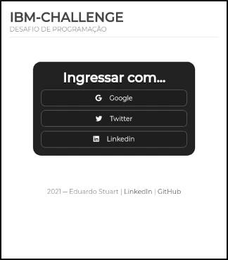
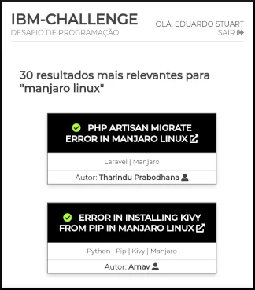

# IBM-Challenge

### Objetivo

Esse projeto, que faz parte de um desafio de programação _**fullstack**_ e que pode ser testado no endereço https://ibm-challenge.eduardostuart.pro.br, busca atender aos seguintes propósitos:

  * Indicar soluções para possíveis problemas envolvendo o desenvolvimento de sistemas
  * Proporcionar uma interface amigável para a consulta da API pública do site **StackOverflow**
  * Permitir que as consultas sejam feitas usando termos específicos ou trechos de código 

Os seguintes requisitos técnicos deveriam ser seguidos:

  * Somente usuários identificados poderiam fazer uso da ferramenta
  * A identificação precisaria ser feita através de serviços como **Google**, **Twitter** ou **LinkedIn**
  * O sistema deveria manter um registro com as últimas consultas feitas pelos usuários 
  * O projeto precisaria seguir as melhores práticas de desenvolvimento de software
  * A interface deveria ser intuitiva e com suporte a dispositivos móveis
  * O sistema deveria estar em produção

As seguintes tecnologias foram usadas para a realização desse desafio:

  * Backend desenvolvido em **NodeJS**
  * Banco de dados **MongoDB**
  * Frontend criada usando puro HTML5 e CSS3

### Telas capturadas






### Instruções


O código-fonte do projeto está disponível para todos que estiverem interessados em estudá-lo/adaptá-lo. 

Todo o código está fartamente documentado.

Porém, para executá-lo localmente, será preciso criar um arquivo **.env**, na pasta raiz do projeto, com todas as variáveis de ambiente que são necessárias para a correta operação do sistema.

O arquivo deverá definir as seguintes variáveis:

```bash
IBM_CHALLENGE_PORT=5000
SESSION_SECRET=
MONGO_URI=
GOOGLE_CLIENT_ID=
GOOGLE_CLIENT_SECRET=
TWITTER_API_KEY=
TWITER_API_SECRET_KEY=
LINKEDIN_CLIENT_ID=
LINKEDIN_CLIENT_SECRET=
```

São elas:
  * **IBM_CHALLENGE_PORT**: define em qual porta o servidor estará em operação
  * **SESSION_SECRET**: um string usado para criptografar as seções ─ você pode definir qualquer combinação de letras e números para essa variável
  * **MONGO_URI**: o URI usado para se conectar ao banco de dados MongoDB. Você pode gerar um gratuitamente em https://cloud.mongodb.com/
  * **GOOGLE_CLIENT_ID** & **GOOGLE_CLIENT_SECRET**: usadas para autenticar o usuário usando o **Google** ─ obtenha esses valores no endereço https://console.cloud.google.com/
  * **TWITTER_API_KEY** & **TWITTER_API_SECRET_KEY**: usadas para autenticar o usuário através do **Twitter** ─ obtenha em https://developer.twitter.com/
  * **LINKEDIN_CLIENT_ID** & **LINKEDIN_CLIENT_SECRET**: usadas para autenticar o usuário usando o **LinkedIn** ─ obtenha em https://www.linkedin.com/developers/

Após clonar o projeto, não esqueça de instalar as dependências, executando o seguinte comando:
```bash
npm install
```
--- 

### Contato

Em caso de dúvidas, críticas ou sugestões, não deixe de entrar em contato.

Toda e qualquer sugestão de melhoria, seja no código, seja nas técnicas que foram empregadas, são sempre muito bem-vindas. 

Você pode entrar em contato via [LinkedIn](https://www.linkedin.com/in/eduardo-stuart/).